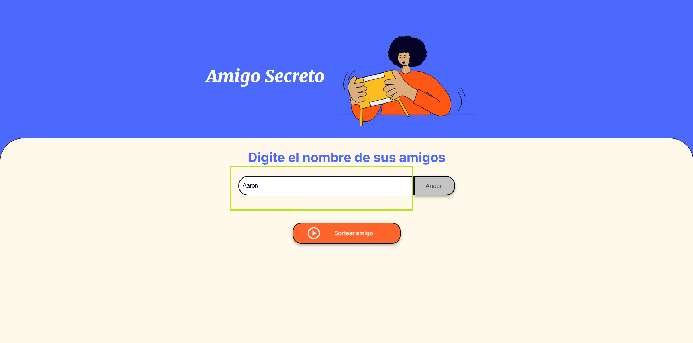
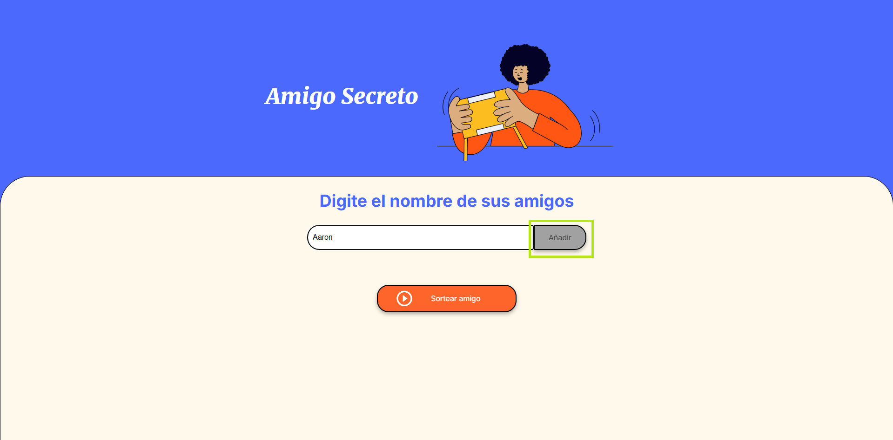
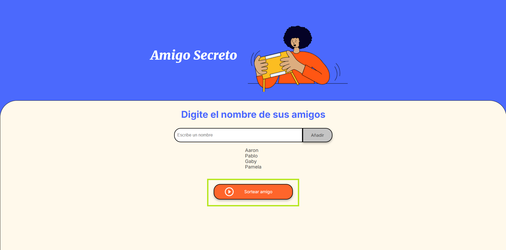

<h1 align="center">🏆 Challenge: Amigo Secreto</h1>
<p align="center">
    
</p>
<p align="center">
    
    
</p>

## Tecnologías utilizadas en el proyecto


## Descripción del proyecto.
Este proyecto tiene como objetivo desarrollar la implementación de la funcionalidad de una página web. En la que se ingresaran los nombres de sus amigos y se sortarán para obtener a su amigo secreto.
La página web requerirá que en la caja de texto ingrese el nombre de sus amigos mientras se enlistarán automaticamente debajo de esta caja de texto, una vez ingresados los nombres de sus amigos deseados
deberá dar clic en el botón "sortear", el cual sorteara el nombre de un amigo, y lo mostrará en pantalla.

## ¿Cómo utilizar la página?
1️⃣:
Deberá escribir el nombre del amigo al que desea ingresar a la lista.
<p align="center">
    
</p>

2️⃣:
Deberá dar clicl en el boton "Añadir" para agregar al amigo.
<p align="center">
    
</p>

3️⃣:
Se mostrarán los nombres ingresados de los amigos que desea añadir a la lista.
<p align="center">
    
</p>

4️⃣:
Deberá dar clic en el boton "Sortear" para hacer el sorteo del nombre de sun amigo secreto.
<p align="center">
    
</p>

5️⃣:
Se muestra el resultado con el nombre de su amigo secreto.
<p align="center">
    
</p>

## ¿Cómo funciona el código?
Ulitizando ```javascript``` como el lenguaje para el desarrollo de la funcionalidad, se han desarrollado 3 funciones principales. La primera función añadirá el nombre escrito en la caja de texto a un array en donde se guardarán los nombres de los amigos ingresados, la función se ejecuta al dar clic en el botón "Añadir". La segunda función permite actualizar la lista de amigos cada vez que se ingres un nuevo nombre, mostrará los nombres de los amigos en forma de lista debajo de la caja de texto. La tercera función permite hacer el sorteo
de los nombres de los amigos ingresados, y posteriormente limpiará la lista desplegada de los amigos y mostrará unicamente el amigo sorteado.

Se declaran las variables ```nameFriend``` en donde se alojará el nombre ingresado en la caja de texto, ```friendsList``` un array en donde se guardarán los nombres ingresados y ```showedList``` la cuál selecciona la lista que se mostrará debajo de la caja de texto.
```javascript
let nameFriend = "";
const friendsList = [];
const showedList = document.getElementById('listaAmigos');
```

En la función ```addFriend``` 
1. A la variable ```nameFriend``` se le asigna el valor que contiene la caja de texto.
2. Se evalua si la caja de texto se encuentra vacía, de ser así se manda una alerta al usuario.
3. En caso de encontrar un valor, limpia la caja de texto y evalua si el nombre existe en el array ```friendsList```.
4. Si el nombre ingresado es existente dentro del array se envía una alerta al usuario.
5. De no existir dentro del array agrega el nombre a la lista ```showedList``` con un elememto ```<li>```.
```javascript
function addFriend(){
    nameFriend = document.getElementById('amigo').value;
    if (nameFriend === ''){
       alert("Por favor ingresa un nombre");
    } else {
       cleanInputBox();
       if(friendsList.includes(nameFriend)){
          alert("Atencion! Ya has ingresado este nombre");
       }  else {
          friendsList.push(nameFriend);
       }
    }
    return;
 }
```

En la función ```uptadeFriendsList```
1. Se limpia la lista ```showedList``` para evitar duplicaciones.
2. Con un loop ```for``` se itera hasta el numero total de nombres ingresados.
3. Dentro del loop de declara la constante ```friend``` la cuál creara un nuevo elemento ```<li>```.
4. A la variable ```friend``` se le asigna el tamplate string con el índice iterado del array ```friendsList```.
5. Se agrega el elemento ```<li>``` a la lista ```showedList```.
```javascript
function updateFriendsList() {
    showedList.innerHTML = "";
    for (let i = 0; i < friendsList.length; i++){
       const friend = document.createElement('li');
       friend.innerHTML = `${friendsList[i]}`;
       showedList.appendChild(friend);
    }
    return;
 }
```

En la función ```raffleSecretFriend```
1. Se evalua si el array se encuentra vacío.
2. De encontrarse vacio se emite una alerta al usuario.
3. De contener los nombres de sus amigos:
4. Se declara la constante ```showedSecretFriend``` en donde se seleccionara la lista en donde se muestra el resultado.
5. Se declara la variable ```indexFriend``` y se le asiga el numero pseudo-aleatorio generado.
6. Se declara la variable ```secretFriend``` en donde se crea un nuevo elemento ```<li>```.
7. A la variable ```secretFriend``` se le asigna el template string con el valor del elemento dentro del array ```friendList``` que tiene como índice en numero generado en la variable ```indexFriend```.
8. A la lista ```showedSecretFriend``` se le agrega el elemento ```<li>``` mostrando el resultado.
```javascript
function raffleSecretFriend() {
    if (friendsList.length > 0){
       showedList.innerHTML = "";
       const showSecretFriend = document.getElementById('resultado');
       let indexFriend = Math.floor(Math.random()*friendsList.length);
       let secretFriend = document.createElement('li');
       secretFriend.innerHTML = `${friendsList[indexFriend]} es tu amigo secreto!`;
       showSecretFriend.appendChild(secretFriend);
    } else {
       alert("No hay amigos disponibles para sortear");
    }
 }
```

En la función ```cleanInputBox```
1. Se asigna el valor ```''``` a la caja de texto. De esta manera se limpia la caja.
```javascript
 function cleanInputBox(){
    document.getElementById('amigo').value = '';
 }
```


